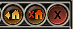

# AHKPrioritize

Usage:

You will need to change the coordinates of the Relocate.ahk and PrioritizePixelSearch.ahk files and use the GetMouseCoordinates.ahk file to determine the coordinates of the the upper and lower region (Y-axis) as well as the Width of it (X-axis) of the Prioritize Box as well as the building relocate button. Otherwise you will pick up pixels on the screen that are of the similar color, but since we tell it the coordinates to search in, it will only pick up pixels in that search area, meaning we identify the pixel range of the box we want to click.

So you would want to find the coordiantes of these boxes and make sure that you're only searching in this area for the pixels you want to snap the mouse to and click on.

Prioritize Box Example:

Relocate Building Example:

The area will vary depending on hud size.
